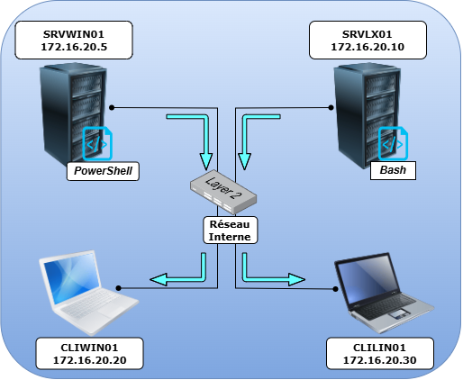

## Sommaire 

1. [ Introduction](#1-introduction)
2. [ Description du projet](#2-description-du-projet)
3. [ Membres du groupe par sprint](#3-membres-du-groupe-par-sprint)
4. [Technologies Utilisées](#4-technologies-utilisées)
5. [ Logiciel](#5-logiciel)
6. [ Difficultés rencontrées](#6-difficultés-rencontrées)
7. [ Solutions trouvées](#7-solutions-trouvées)
8. [ Améliorations possibles](#8-améliorations-possibles)

# 1. Introduction

L’objectif consiste à concevoir et développer une solution d’administration centralisée permettant la gestion et la supervision de systèmes opérant sur des plateformes hétérogènes.

# 2. Description du projet

L'objectif principal est de fournir une interface facilitant l'exécution de tâches via des scripts telles que la configuration, le déploiement de correctifs, la gestion des utilisateurs et la surveillance des performances, réduisant ainsi la complexité opérationnelle et améliorant l'efficacité et la sécurité à travers l'ensemble du parc informatique, depuis des servers Debian et Windows vers des clients Linux et Windows.

# 3. Membres du groupe par sprint

**Sprint 1**

| Membre  | Rôle       | Missions                                                                               |
| ------- | ---------- | -------------------------------------------------------------------------------------- |
| Révine  | PO         | BackLog, configuration machine Win11/Debian ,changer nom des machines/utilisateur, ssh |
| Cédric  | SM         | README.md , pseudo-code, configuration machine Win11/WinServer  ,ssh                   |
| Saiah   | Technicien | GUID_USER.md , configuration machine Ubuntu/WinServer , ssh                            |
| Grégory | Technicien | INSTALL.md , configuration machine Ubuntu/Debian , ssh                                 |

**Sprint 2**

| Membre  | Rôle       | Missions                                                                               |
| ------- | ---------- | -------------------------------------------------------------------------------------- |
| Révine  | SM         | Backlog, script Bash, Test du script                                                   |
| Cédric  | PO         | Script Powershell, Test script, Configuration WinRM                                    |
| Saiah   | Technicien | Script Bash, MAJ Github                                                                |

**Sprint 3**

| Membre  | Rôle         | Missions                                                                                     |
| ------- | ------------ | -------------------------------------------------------------------------------------------- |
| Révine  | Technicien   |                                                                                              |
| Cédric  | SM           |                                                                                              |
| Saiah   | PO           |                                                                                              |

**Sprint 4**

| Membre  | Rôle | Missions                                                                                     |
| ------- | ---- | -------------------------------------------------------------------------------------------- |
| Révine  |      |                                                                                              |
| Cédric  |      |                                                                                              |
| Saiah   |      |                                                                                              |

# 4.  **_Technologies Utilisées_**

Avant de déployer l'outil d'administration centralisée, les éléments suivants doivent être en place :

## Infrastructure réseau
- Réseau : 172.16.10.0/24
- Passerelle : 172.16.10.254
- Masque : 255.255.255.0
- DNS : 8.8.8.8

## Machines virtuelles
4 VMs hébergées sur Proxmox :

| Machine  | IP            | OS                           | Rôle                    |
|----------|---------------|------------------------------|-------------------------|
| SRVLX01  | 172.16.10.10  | Debian 12/13 CLI             | Serveur principal       |
| SRVWIN01 | 172.16.10.5   | Windows Server 2022/2025 GUI | Serveur secondaire      |
| CLILIN01 | 172.16.10.30  | Ubuntu 24 LTS                | Client Linux            |
| CLIWIN01 | 172.16.10.20  | Windows 10/11                | Client Windows          |

## Logiciels requis

### Sur SRVLX01 (Debian) :
- OpenSSH Server
- keychain (gestion des clés SSH)
- Bash 4.0+

### Sur SRVWIN01 (Windows Server) :
- OpenSSH Server (Windows Feature)
- PowerShell Core 7.4+ minimum
- ssh-agent (service Windows)

### Sur CLILIN01 (Ubuntu) :
- OpenSSH Server

### Sur CLIWIN01 (Windows) :
- OpenSSH Server (Windows Feature)

## Compte utilisateur
- Un compte utilisateur **`wilder`** doit exister sur les 4 machines
- Avec les mêmes permissions (sudo/admin selon l'OS)
- Utilisé pour toutes les connexions SSH

## Arborescence de fichiers

### SRVLX01 (Debian) :

### SRVWIN01 (Windows Server) :

### Clients (auto-créés par les scripts) :
- CLILIN01 : 
- CLIWIN01 : 

---

**Note :** Pour les instructions d'installation détaillées, consulter [INSTALL.md](INSTALL.md)

# 5. Logiciel
    

   - OpenSSH Server (sur toutes les machines)
   - Keychain (sur SRVLX01 - Debian)
   - ssh-agent (sur SRVWIN01 - Windows Server)
   - PowerShell Core 7.4+ (sur SRVWIN01)

### Détails des choix SSH et PowerShell :

**Authentification SSH par clés :**
- Type de clé : **ed25519** (plus sécurisée et performante que RSA)
- Gestion des clés sur Debian : **keychain** (persiste les clés entre les sessions)
- Gestion des clés sur Windows : **ssh-agent** (service Windows natif)

**PowerShell Core :**
- Version minimale : **7.4+** (requis pour SRVWIN01)
- Avantages : compatibilité multiplateforme, performances améliorées, syntaxe moderne
- Installation : via `winget install Microsoft.PowerShell`

**Compte utilisateur uniforme :**
- Un utilisateur identique **`wilder`** est créé sur les 4 machines
- Facilite la gestion SSH et les permissions
- Simplifie les scripts (pas de gestion multi-utilisateurs)

# 6. Difficultées rencontrées

1. Deconnexion de WinRM lors du redémarrage de la machine.

2. Absence d'une liste des tâches a réaliser dans le script Bash (au cours du Sprint 3) afin de bien avoir toutes les fonctions de chaque tâches dans le script.

# 7. Solutions trouvées

1. Lancer le service en automatique afin que WinRM puisse être actif a chaque redémarrage de la machine.

2. Création et implémentation d'une liste des tâches a réliser pour le script Bash dans le repo GitHub pour que tout le groupe ait un visuel dessus.

## Sécurité
- Changement du port 22 pour SSH par le port 2222
