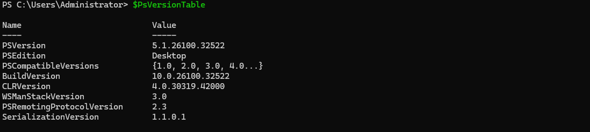
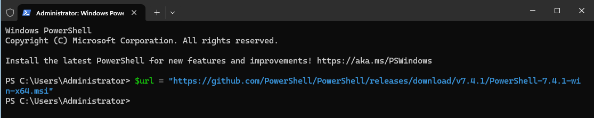
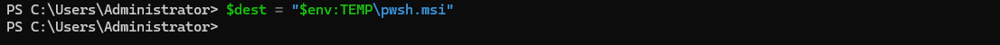
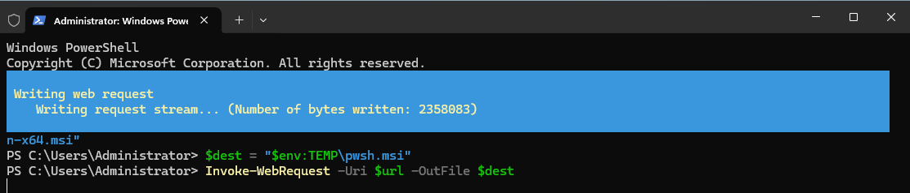
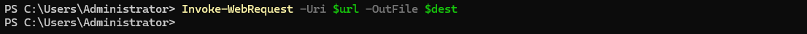

## Table des matières

  

---

1. [Introduction](#1-introduction)

2. [Pré-requis d'utilisation](#2-pré-requis)

    [2.1. Systeme de sécurité : Openssh](#-21-système-de-sécurité-openssh)

3. [Utilisation des scripts](#-3-utilisation-des-scripts)

	 [3.1. Execution du Script Bash](#-31-execution-du-script-bash)

	  [3.1.1. Lancement sur serveur Debian](#-311-lancement-sur-serveur-debian)
	       
	  [3.1.2. Cible](#-312-cible)

	[3.2. Execution du Script PowerShell](#-32-execution-du-script-powershell)

	  [3.2.1 Lancement sur serveur Windows Server 2025](#-lancement-sur-windows-server-2025)

	  [3.2.2 Cible](#-322-cible)

4. [La navigation](#4-navigation)

    [4.1. Action sur les utilisateurs](#-41-action-sur-les-utilisateurs)

    [4.2. Action sur les machines clientes et serveur](#-42-action-sur-les-machines-clientes)

5. [Informations enregistrées](#5-informations-enregistrees)

    [5.1. Affichage des informations](#-51-affichage-des-informations)

   [5.2. Enregistrement des informations](#-52-enregistrement-des-informations)

	[5.2.1 Dossier infos](#-521-dossier-infos)

	[5.2.2 Journalisation](#-522-journalisation)

6. [Fin de script](#6-fin-du-script)

7.  [FAQ](#7-faq)

  

---

  

# Guide d'utilisation des scripts créés

  

# 1. Introduction

  

L'utilisation des scripts Bash et PowerShell créés au cours de notre projet va vous être détaillé ici.

Les actions a effectuer sur les machines du réseau vont être de l'administration et de la récupération d'informations.

  
  
  

---
# 2. Pré-requis d'utilisation

#### 2.1 Systeme de securité : Openssh
  
  
  blablabla
  
#### 2.2 Configuration des machine windows et Administration Distante de PowerShell (WinRM)


#### 1. Installation de PowerShell 7 (poste serveur)


- Version de PowerShell actuelle

Commande pour connaitre la version de son PowerShell
```
$PsVersionTable.PSVersion
```




- Le but ?
Passer de Windows PowerShell 5.1 à PowerShell Core (pwsh).

- Pourquoi ? 
Pour avoir le même langage sur Windows et Ubuntu (Multiplateforme). Cela évite les erreurs de compatibilité de syntaxe entre tes scripts.

Commande (Installation propre par MSI) :

 Ouvrir l'invite de commande "Powershell".

Premièrement taper :

```
$url = "https://github.com/PowerShell/PowerShell/releases/download/v7.4.1/PowerShell-7.4.1-win-x64.msi"
```


Puis 
```
$dest = "$env:TEMP\pwsh.msi"
```


Ensuite
```
Invoke-WebRequest -Uri $url -OutFile $dest
```




Enfin
```
Start-Process msiexec.exe -ArgumentList "/i $dest /quiet /norestart" -Wait``
```


Pour finir : Verification que Powershell 7 est bien installé 

Aller dans la barre de recherche windows et taper 
```
Windows Powershell
```

![[Administration-Distante-Powershell-8.png]](RESOURCE/Administration-Distante-Powershell-8.png)

Il est bien présent : l'installation a réussie.

- Au lancement de powershell, il m'indique qu'une nouvelle version existe a télécharger via ce lien :
```
https://github.com/PowerShell/PowerShell/releases/tag/v7.6.0
```
![[Administration-Distante-Powershell-10.png]](RESOURCE/Administration-Distante-Powershell-10.png)

Une fois téléchargé, le lancer :

![[Administration-Distante-Powershell-9.png]](RESOURCE/Administration-Distante-Powershell-9.png)


Dans le dossier téléchargement :


![[Administration-Distante-Powershell-11.png]](RESOURCE/Administration-Distante-Powershell-11.png)


![[Administration-Distante-Powershell-12.png]](RESOURCE/Administration-Distante-Powershell-12.png)

![[Administration-Distante-Powershell-13.png]](RESOURCE/Administration-Distante-Powershell-13.png)

![[Administration-Distante-Powershell-14.png]](RESOURCE/Administration-Distante-Powershell-14.png)

![[Administration-Distante-Powershell-15.png]](RESOURCE/Administration-Distante-Powershell-15.png)


![[Administration-Distante-Powershell-16.png]](RESOURCE/Administration-Distante-Powershell-16.png)


Installation complète.

![[Administration-Distante-Powershell-17.png]](RESOURCE/Administration-Distante-Powershell-17.png)


Ouverture de Powershell 7.6 :

![[Administration-Distante-Powershell-18.png]](RESOURCE/Administration-Distante-Powershell-18.png)


#### 2. Configuration du Poste Client (Cible : Windows 11)

Attention !!!     =>  C'est l'étape la plus critique. Sans ces 3 points, le serveur ne peut pas "entrer" dans le client.

#### A. Le Profil Réseau (La clé du Pare-feu)

Pourquoi ?
- Par défaut, une VM peut être en profil "Public". Windows bloque alors WinRM pour des raisons de sécurité. Le passer en "Privé" ouvre automatiquement les routes nécessaires.


Dans l'invite de commande PowerShell et taper :

``` 
Get-NetConnectionProfile | Set-NetConnectionProfile -NetworkCategory Private
```

![[Administration-Distante-Powershell-19.png]](RESOURCE/Administration-Distante-Powershell-19.png)


#### B. Activation de WinRM (Le protocole)

Pourquoi ? 
- C'est le service qui écoute les ordres envoyés par Invoke-Command. On le configure en automatique pour qu'il survive à un redémarrage (Reboot).


Tapez 
```
Enable-PSRemoting -Force
```


![[Administration-Distante-Powershell-20.png]](RESOURCE/Administration-Distante-Powershell-20.png)


Puis
```
Set-Service WinRM -StartupType Automatic
```


![[Administration-Distante-Powershell-21.png]](RESOURCE/Administration-Distante-Powershell-21.png)


#### C. La Levée du Verrou Admin (UAC Distant).

Pourquoi ? 
- Dans un groupe de travail (sans domaine AD), Windows bloque les privilèges "Admin" pour les connexions distantes.
- Cette clé de registre permet à ton utilisateur "$USER" d'avoir les pleins pouvoirs à distance.

Taper 
```
New-ItemProperty -Path "HKLM:\SOFTWARE\Microsoft\Windows\CurrentVersion\Policies\System" -Name "LocalAccountTokenFilterPolicy" -Value 1 -PropertyType DWord -Force
Diagnostic et Vérification (Depuis le Serveur),
```


![[Administration-Distante-Powershell-22.png]](RESOURCE/Administration-Distante-Powershell-22.png)


###### Le but  étant de tester avant de lancer le script final.

Test de port (Couche 4) : Vérifie si le port 5985 (WinRM HTTP) est ouvert.

```
Test-NetConnection -ComputerName 172.16.20.20 -Port 5985
```

![[Administration-Distante-Powershell-23.png]](RESOURCE/Administration-Distante-Powershell-23.png)


Puis

Test WinRM (Couche 7) : Vérifie si le service répond intelligemment.

```
Test-WSMan -ComputerName 172.16.20.20 
```

![[Administration-Distante-Powershell-24.png]](RESOURCE/Administration-Distante-Powershell-24.png)

---
# 3. Utilisation des scripts


#### 3.1 Execution du script Bash
###### 3.1.1 Lancement sur serveur Debian


blablablablabla


###### 3.1.2 Cible


blablablablablablabla


#### 3.2 Execution du script Powershell
###### 3.2.1 Lancement sur serveur Windows Server 2025


blablablablablabla


###### 3.2.2 Cible

## Utilisation de Powershell sur client Linux

Pour lancer le shell en mode utilisateur exécutez la commande ci dessous.

````
pwsh
`````

Si vous voulez les droits d'administration, exécutez la commande suivante.

````
sudo pwsh
`````

Ici la derniere version de Powershell est bien installée et s'exécute bien. 


---
# 4. La navigation

#### 4.1 Action sur les utilisateurs 

blablablablablablablabla

#### 4.2 Action sur les machines client et serveur  


  blablablablablablablabla


---
# 5. Informations enregistrées

#### 5.1 Affichage des informations


Les informations sont les suivantes ......


#### 5.2 Enregistrement des informations

###### 5.2.1 Dossier d'informations


Le dossier d'information qui va contenir les deux fichiers event_log sont crées .......


###### 5.2.1 Journalisation

  
Le processus de journalisation est ainsi fait et nous pourrons voir ces fameux log dans le fichier.........


  
---
# 6. Fin de script

  
  Le script est arrété lorsque plus aucune tache ne veut etre réalisée par l'utilisateur et par le client ........
  
  
  
---
# 7. FAQ


Les question les plus fréquement posées concernant les differents sujets abordés vont vous etre présentées avec leurs réponse afin de pouvoir répondre aux soucis/préocupations des utilisateurs ......... :


##### Question 1


blablablablabla


##### Question 2


blablablablabla


